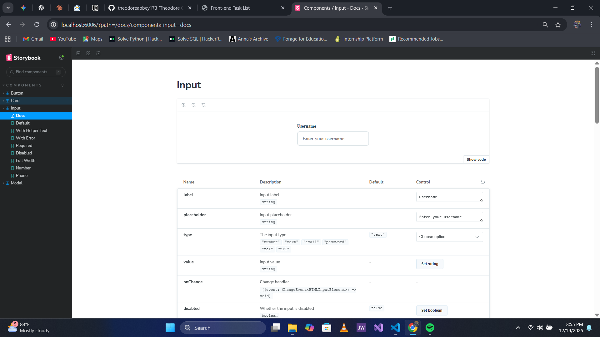
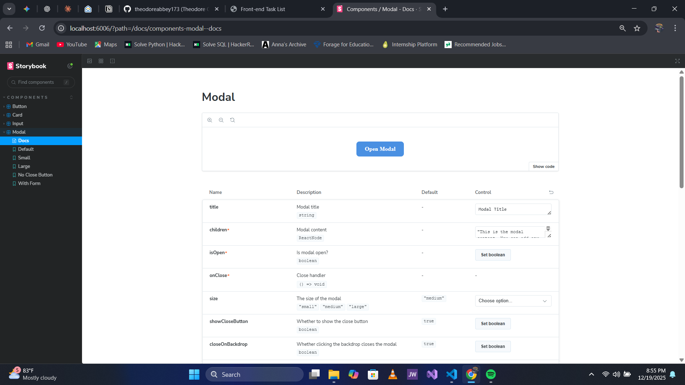

# Custom Component Library
**Level 3 (Advanced) - Task 1**  
*Codveda Technology Internship*

A modern, accessible React component library built with TypeScript, documented with Storybook, and ready for NPM publishing.

## 📦 What's Inside

This component library includes:

- **Button** - Customizable button with multiple variants and sizes
- **Card** - Flexible card component with images and elevation
- **Input** - Form input with validation and error handling
- **Modal** - Accessible modal dialog with keyboard support

All components follow accessibility best practices with ARIA attributes and keyboard navigation.

---

## 🚀 Quick Start Guide

Follow these steps to set up and complete your Level 3 Task 1:

### Step 1: Prerequisites

Make sure you have these installed:
- **Node.js** (v16 or higher) - [Download here](https://nodejs.org/)
- **npm** (comes with Node.js)
- **Git** - [Download here](https://git-scm.com/)

Check your installations:
```bash
node --version
npm --version
git --version
```

## 🌐 Live Demos

| Project | Live Demo | Source Code |
|---------|-----------|-------------|
| Task 1 - Custom Component Library | [Demo Link](https://custom-component-libraries.netlify.app/) | [View Code](./custom-component-library/) |

### Step 2: Create Project Structure

1. Create a new folder for your project:
```bash
mkdir custom-component-library
cd custom-component-library
```

2. Initialize Git:
```bash
git init
```

3. Create the following folder structure:
```
custom-component-library/
├── .storybook/
│   ├── main.ts
│   └── preview.ts
├── src/
│   ├── components/
│   │   ├── Button/
│   │   │   ├── Button.tsx
│   │   │   ├── Button.css
│   │   │   └── Button.stories.tsx
│   │   ├── Card/
│   │   │   ├── Card.tsx
│   │   │   ├── Card.css
│   │   │   └── Card.stories.tsx
│   │   ├── Input/
│   │   │   ├── Input.tsx
│   │   │   ├── Input.css
│   │   │   └── Input.stories.tsx
│   │   └── Modal/
│   │       ├── Modal.tsx
│   │       ├── Modal.css
│   │       └── Modal.stories.tsx
│   └── index.ts
├── .gitignore
├── .npmignore
├── package.json
├── rollup.config.js
├── tsconfig.json
└── README.md
```

### Step 3: Copy Files

Copy all the provided files into their respective locations according to the structure above.

### Step 4: Install Dependencies

Run this command to install all required packages:
```bash
npm install
```

This will install:
- React & React DOM
- TypeScript
- Rollup (bundler)
- Storybook
- Babel
- All necessary plugins

**Note:** This may take 3-5 minutes. Be patient!

### Step 5: Run Storybook

Start Storybook to view your components:
```bash
npm run storybook
```

This will:
- Start a local server
- Open your browser automatically to `http://localhost:6006`
- Show all your components with interactive documentation

**What to do in Storybook:**
- Click on each component in the sidebar
- Try changing props in the "Controls" panel
- Test different variants and sizes
- Check the "Accessibility" tab for a11y compliance
- Take screenshots for your submission

### Step 6: Build Your Library

Build the production-ready library:
```bash
npm run build
```

This creates a `dist/` folder with:
- `index.js` - CommonJS bundle
- `index.esm.js` - ES Module bundle
- `index.d.ts` - TypeScript definitions
- CSS files

### Step 7: Test Your Components

Create a test file `test.html` in your project root:
```html
<!DOCTYPE html>
<html>
<head>
  <title>Component Test</title>
  <link rel="stylesheet" href="dist/index.css">
</head>
<body>
  <div id="root"></div>
  <script type="module">
    import React from 'https://esm.sh/react@18';
    import ReactDOM from 'https://esm.sh/react-dom@18/client';
    import { Button } from './dist/index.esm.js';
    
    const App = () => {
      return React.createElement(Button, { 
        variant: 'primary',
        onClick: () => alert('Clicked!')
      }, 'Test Button');
    };
    
    ReactDOM.createRoot(document.getElementById('root')).render(React.createElement(App));
  </script>
</body>
</html>
```

Open `test.html` in your browser to test!

### Step 8: Prepare for NPM Publishing

1. **Create NPM Account**: Go to [npmjs.com](https://www.npmjs.com) and sign up

2. **Login to NPM**:
```bash
npm login
```

3. **Update package.json**: Change `@your-username/custom-component-library` to `@YOUR-NPM-USERNAME/custom-component-library`

4. **Publish**:
```bash
npm publish --access public
```

---

## 📚 Component Documentation

### Button Component

**Usage:**
```tsx
import { Button } from '@your-username/custom-component-library';

<Button variant="primary" size="medium" onClick={() => console.log('Clicked!')}>
  Click Me
</Button>
```

**Props:**
- `variant`: 'primary' | 'secondary' | 'danger' | 'success'
- `size`: 'small' | 'medium' | 'large'
- `disabled`: boolean
- `fullWidth`: boolean
- `onClick`: function
- `ariaLabel`: string (for accessibility)

### Card Component

**Usage:**
```tsx
import { Card } from '@your-username/custom-component-library';

<Card 
  title="My Card" 
  subtitle="Subtitle text"
  imageUrl="https://example.com/image.jpg"
  elevation="medium"
  hoverable
>
  Card content goes here
</Card>
```

**Props:**
- `title`: string
- `subtitle`: string
- `imageUrl`: string
- `imageAlt`: string
- `elevation`: 'low' | 'medium' | 'high'
- `hoverable`: boolean
- `onClick`: function

### Input Component

**Usage:**
```tsx
import { Input } from '@your-username/custom-component-library';

<Input 
  label="Email"
  type="email"
  placeholder="your@email.com"
  value={value}
  onChange={(e) => setValue(e.target.value)}
  error="Invalid email"
  required
/>
```

**Props:**
- `label`: string
- `type`: 'text' | 'email' | 'password' | 'number' | 'tel' | 'url'
- `placeholder`: string
- `value`: string
- `onChange`: function
- `error`: string
- `helperText`: string
- `required`: boolean
- `disabled`: boolean

### Modal Component

**Usage:**
```tsx
import { Modal } from '@your-username/custom-component-library';

const [isOpen, setIsOpen] = useState(false);

<Modal 
  isOpen={isOpen}
  onClose={() => setIsOpen(false)}
  title="Modal Title"
  size="medium"
>
  Modal content
</Modal>
```

**Props:**
- `isOpen`: boolean (required)
- `onClose`: function (required)
- `title`: string
- `size`: 'small' | 'medium' | 'large'
- `showCloseButton`: boolean
- `closeOnBackdrop`: boolean

---

## ♿ Accessibility Features

All components include:

✅ **ARIA Attributes** - Proper roles and labels
✅ **Keyboard Navigation** - Tab, Enter, Escape support
✅ **Focus Management** - Visible focus indicators
✅ **Screen Reader Support** - Semantic HTML and descriptive text
✅ **Color Contrast** - WCAG AA compliant

Test accessibility in Storybook using the A11y addon!

---

## 📸 Project Screenshots
### Button Component


### Card Component


### Input Component


### Modal Component


---

## 📦 Using Your Published Package

After publishing, install it in any React project:

```bash
npm install @your-username/custom-component-library
```

Then use it:
```tsx
import { Button, Card, Input, Modal } from '@your-username/custom-component-library';
import '@your-username/custom-component-library/dist/index.css';

function App() {
  return (
    <div>
      <Button variant="primary">Hello World</Button>
      <Card title="My Card">Content here</Card>
    </div>
  );
}
```

---

**Hashtags to use:**
#CodvedaJourney #CodvedaExperience #FutureWithCodveda #ReactJS #ComponentLibrary #Storybook #WebDevelopment

---

## 🛠️ Troubleshooting

### "Command not found: npm"
- Install Node.js from nodejs.org

### "Module not found" errors
- Run `npm install` again
- Delete `node_modules` and `package-lock.json`, then run `npm install`

### Storybook won't start
- Check if port 6006 is in use
- Try `npm run storybook -- -p 6007` to use a different port

### Build fails
- Ensure all files are in correct locations
- Check for TypeScript errors: `npx tsc --noEmit`

### Can't publish to NPM
- Make sure you're logged in: `npm whoami`
- Package name must be unique
- Use scoped package: `@username/package-name`

---

## 📝 Additional Tips

1. **Customize Components**: Feel free to modify colors, styles, and add new variants

2. **Add More Components**: Create Badge, Alert, Tooltip, or Dropdown components

3. **Write Tests**: Add Jest and React Testing Library for unit tests

4. **Add CI/CD**: Set up GitHub Actions to auto-publish on version tags

5. **Documentation Site**: Deploy Storybook to Netlify or Vercel for live demos

---

## 📞 Support

If you encounter issues:
- Check Storybook documentation: [storybook.js.org](https://storybook.js.org)
- NPM publishing guide: [docs.npmjs.com](https://docs.npmjs.com)
- Contact Codveda: support@codveda.com

---

## 🎓 Learning Resources

- [React TypeScript Cheatsheet](https://react-typescript-cheatsheet.netlify.app/)
- [Storybook Tutorials](https://storybook.js.org/tutorials/)
- [Web Accessibility Guide](https://www.w3.org/WAI/WCAG21/quickref/)
- [NPM Package Publishing](https://docs.npmjs.com/packages-and-modules/contributing-packages-to-the-registry)

---

## 📄 License

MIT License - Feel free to use this in your portfolio and future projects!

---

## 🙏 Acknowledgments

Built as part of the Codveda Technology Internship Program - Level 3, Task 1

## 📧 Contact

For questions or feedback about this project:
- **LinkedIn:** [My LinkedIn Profile](https://linkedin.com/in/theodore-abbey)
- **GitHub:** [My GitHub Profile](https://github.com/theodoreabbey173)
- **Email:** theodoreabbey174@gmail.com
- **Portfolio:** [My Portfolio Website](https://your-portfolio.com)

**Internship**: Codveda Technology  
**Position**: Front-End Development Intern  
**Task**: Level 3 - Task 1: Advanced Animations  


**Good luck with your submission! 🚀**
